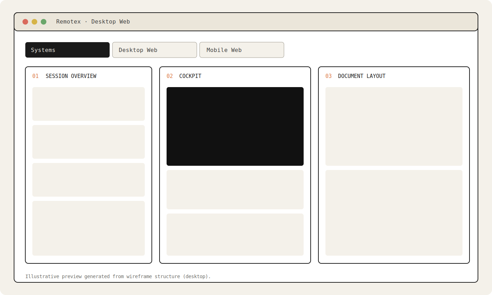
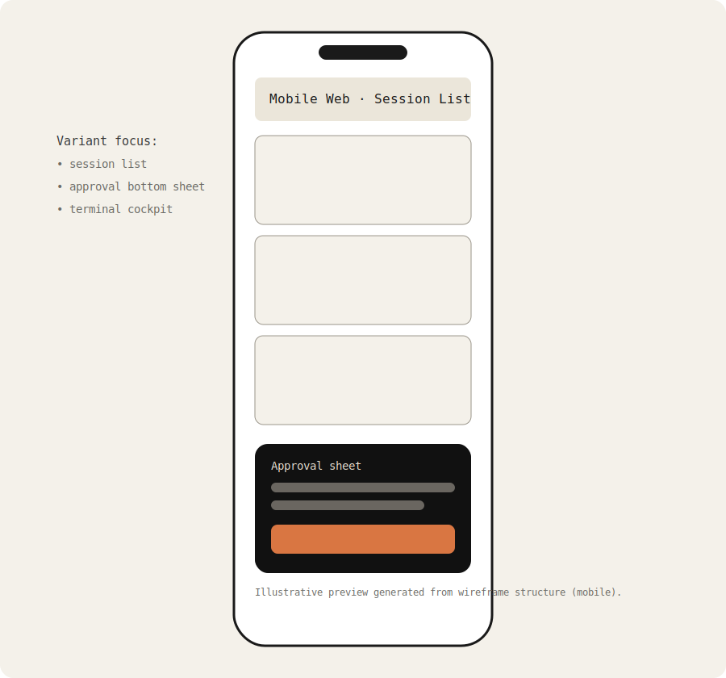

# Remotex Wireframes

A low-fidelity React prototype exploring the UX of **Remotex**, a remote-control client for Codex daemons.

This project is focused on interaction design and information architecture, with four interface surfaces and three variants per surface:

- Systems architecture
- Desktop web
- Mobile web
- Android

## Screenshots

### Desktop Web (illustrative preview)



### Mobile Web (illustrative preview)



> Note: These visuals are static preview assets derived from the current wireframe structure.

## Tech Stack

- React 18
- Vite 5
- Plain CSS

## Getting Started

### Prerequisites

- Node.js 18+
- npm 9+

### Install

```bash
npm install
```

### Run in development

```bash
npm run dev
```

By default, Vite serves the app at `http://localhost:5173`.

### Build for production

```bash
npm run build
```

### Preview production build

```bash
npm run preview
```

## Project Structure

- `src/App.jsx` — App shell, tab navigation, and tweak controls.
- `src/panels/SystemsPanel.jsx` — System topology and trust flows.
- `src/panels/DesktopPanel.jsx` — Desktop workspace wireframes.
- `src/panels/MobilePanel.jsx` — Mobile workflow wireframes.
- `src/panels/AndroidPanel.jsx` — Android-specific wireframes.
- `src/styles.css` — Global design tokens and layout styles.
- `docs/screenshots/` — README preview images.

## Current Status

- Prototype / exploration phase (`v0.1`)
- Not production-ready
- Designed for rapid iteration and layout discussion
