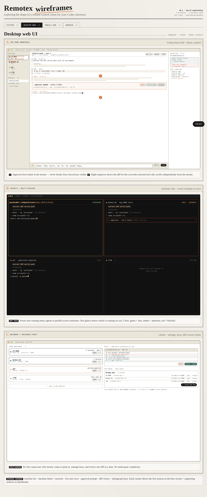
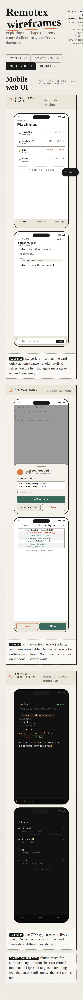

# Remotex

Reach your Codex sessions — the ones running on your home rig, your
work laptop, or a rented server — from any browser, phone, or
native app, through a small relay you control.

Remotex is a three-legged system:

- a **daemon** that bridges a local `codex app-server` to the relay,
- a **relay** that routes sessions between daemons and clients,
- and a set of **clients** (web, Android, wireframes for design work)
  that drive sessions from anywhere.

The backbone is working end-to-end against **real Codex** (via
`codex app-server`, stdio transport). A mock adapter is still
shipped for tests and offline demos. The roadmap below is ordered —
CI, linting, Docker Compose deploy, and real Codex are done; OIDC
auth, Postgres, approvals, and finished UIs are next.

## Demo

**Web client** (`apps/web/`) — pick an online host from your relay,
open a session, send a prompt, watch Codex reasoning / tool calls /
streamed agent messages arrive live:


Empty state (desktop 1440×900) and mobile layout (390×844):


**Wireframes** (`src/`, `npm run dev`) — lo-fi UX exploration across
four surfaces, three variants each:




**Android** (`android/`) — Kotlin + Jetpack Compose. Builds to a
17 MB `app-debug.apk` via `./gradlew assembleDebug`; CI uploads the
APK as a workflow artifact on every change. Device screenshots land
here once the app grows past skeleton-of-screens (currently: token
field, host list, session opener, raw-frame log).

## Repo layout

```
remotex/
├── apps/
│   └── web/              real control-plane client (React + Vite)
├── android/              native Android client (Kotlin + Compose)
├── src/                  wireframes — UX exploration across surfaces
├── prototype/
│   ├── relay/            aiohttp relay + SQLite inventory
│   ├── daemon/           outbound-WSS daemon + Codex adapters
│   ├── web/              single-file control UI (legacy, still works)
│   ├── scripts/e2e_test.py    in-process relay <-> daemon <-> client test
│   └── docs/             architecture, Codex protocol, production plan
├── deploy/
│   ├── Dockerfile.relay  Python 3.12 image for the relay
│   ├── docker-compose.yml  self-host the relay (+ optional Caddy TLS)
│   ├── Caddyfile         TLS reverse proxy config
│   └── README.md         deploy quickstart
├── docs/screenshots/     README images (regenerated by scripts/*.mjs)
├── scripts/              Playwright screenshot drivers
└── .github/workflows/    CI — lint, build, e2e, audit per leg
```

Each subproject has its own README with details:
[`apps/web/README.md`](apps/web/README.md),
[`android/README.md`](android/README.md),
[`prototype/README.md`](prototype/README.md),
[`deploy/README.md`](deploy/README.md).

## Quick start

### 1. Run the relay + a real-Codex daemon

You need the [`codex` CLI](https://github.com/openai/codex) installed
and logged in (`codex login`).

```bash
cd prototype
pip install -r requirements.txt
python3 relay/app.py                          # :8080, demo tokens seeded
# in a second terminal:
python3 -m daemon init \
    --relay-url ws://127.0.0.1:8080/ws/daemon \
    --bridge-token demo-bridge-token \
    --nickname devbox \
    --mode stdio \
    --default-cwd "$PWD" \
    --config ./demo-config.toml
python3 -m daemon run --config ./demo-config.toml
```

Swap `--mode stdio` for `--mode mock` to drive the scripted demo
adapter (no Codex install, no API credits; good for UI-only work).

### 2. Run the web client

```bash
cd apps/web
npm install
npm run dev                                    # :5174, proxies /api + /ws to :8080
```

Visit <http://localhost:5174>, click **Load hosts**, pick the
online host, **Open session**, type a prompt. Codex streams its
reasoning, any tool calls, and the final agent message back through
the relay into the stream view.

### 3. Deploy with Docker Compose

```bash
cd deploy
docker compose up -d --build                   # relay on 127.0.0.1:8080
# with TLS via Caddy + Let's Encrypt:
cp .env.example .env && $EDITOR .env
docker compose --profile tls up -d --build     # binds 80/443
```

The image is multi-stage: a Node layer compiles `apps/web/` to
static assets, the Python layer serves them alongside the relay
API. One container, one endpoint. Details and TLS notes in
[`deploy/README.md`](deploy/README.md).

### 4. Run the Android app

```bash
cd android
cp local.properties.example local.properties   # edit if your SDK isn't at /opt/android-sdk
./gradlew assembleDebug                        # app/build/outputs/apk/debug/app-debug.apk (~17 MB)
./gradlew installDebug                         # to a connected emulator/device
```

The Gradle wrapper is committed (no bootstrap step). The debug
build points at `http://10.0.2.2:8080` (emulator → host loopback).
Override with `-PrelayUrl=https://relay.example.com` for real
targets. CI builds the debug APK on every change and uploads it as
an Actions artifact. Details in
[`android/README.md`](android/README.md).

## What works end-to-end

| Piece                            | Status                                                             |
| -------------------------------- | ------------------------------------------------------------------ |
| Relay REST + WebSocket transport | working; SQLite-backed; demo tokens seeded                         |
| Daemon ↔ relay                   | working; outbound WSS with auto-reconnect                          |
| **Real Codex (stdio)**           | **working; `codex app-server` bridged via `StdioCodexAdapter`**    |
| Mock Codex adapter               | working; still the default for tests + API-free demos              |
| Web client (`apps/web`)          | working; list hosts, open session, stream real Codex events        |
| Android client                   | builds; lists hosts, opens session, logs raw frames                |
| Docker Compose deploy            | working; relay + web bundled; optional Caddy TLS                   |
| CI (`.github/workflows/ci.yml`)  | ESLint × 2 workspaces, ruff, e2e, npm audit, Android APK artifact  |

## Roadmap (in priority order)

1. **Approval flow** — bridge codex's elicitation / approval
   notifications through the relay into the web + Android UI. Frame
   shapes already exist on the relay side.
2. **Fault tests** — daemon-dies-mid-stream, duplicate client, host
   offline, bad tokens. Run as part of `backend-e2e`.
3. **Keycloak / OIDC auth** — replace the demo bearer tokens.
4. **Postgres relay store** — migrate off SQLite.
5. **Audit log + metrics + bounded queues** — the pre-public floor.
6. **Session resume** — client-side reconnect onto a live session
   using `thread/resume`.
7. **Finish Android** — proper event stream rendering (not raw log),
   composer, FCM push for approvals.
8. **Kubernetes deployment** — for multi-user / cloud installs.
9. **iOS / Capacitor wrappers** — once the web and Android surfaces
   settle.

## Development

### Run the full CI locally

```bash
# Web workspaces
npm ci && npm run lint && npm run build
(cd apps/web && npm ci && npm run lint && npm run build)

# Python
(cd prototype && pip install -r requirements-dev.txt && ruff check .)
(cd prototype && python scripts/e2e_test.py)
```

### Regenerate screenshots

```bash
# Wireframes (requires `npm run dev` on :5173)
npm run screenshots

# Web client (requires relay + daemon + `apps/web` dev server)
node scripts/capture-web-screenshots.mjs
```

Both write into `docs/screenshots/`.

## Status

`v0.1` — the backbone works, the demo works, the product doesn't
yet. Expect surfaces, variants, and the relay protocol to keep
moving until the roadmap items above land.

## License

No license has been chosen yet. Treat the repository as
"all rights reserved" until one is added.
