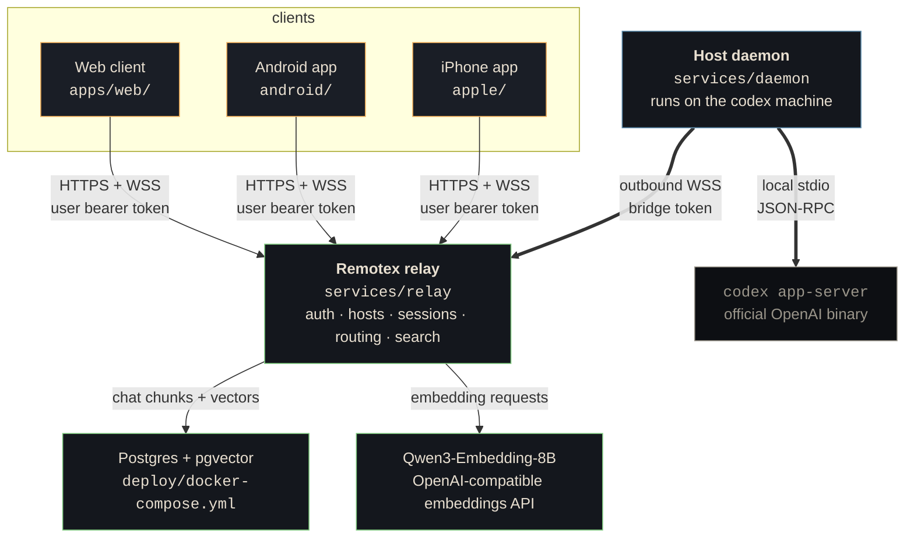
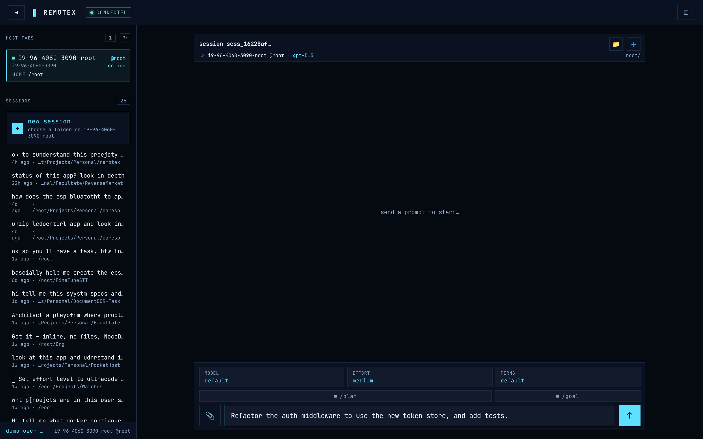
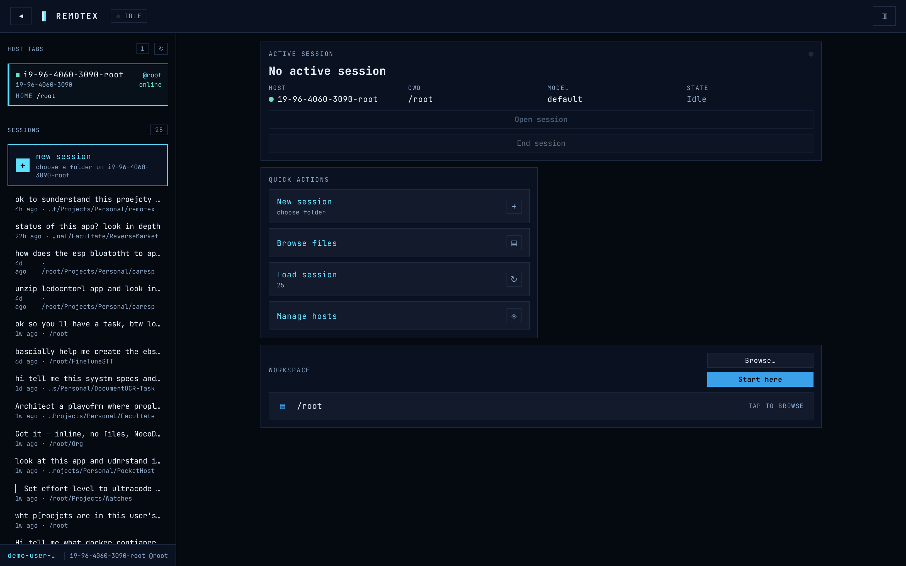
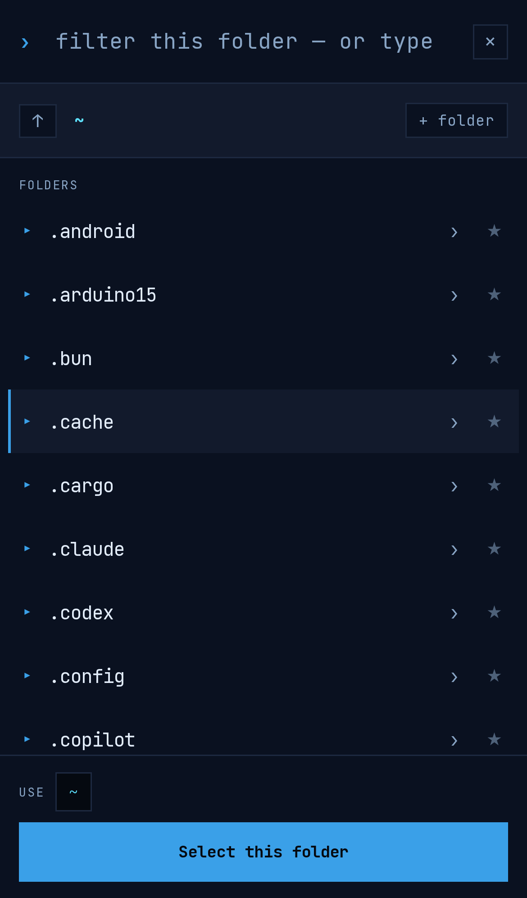
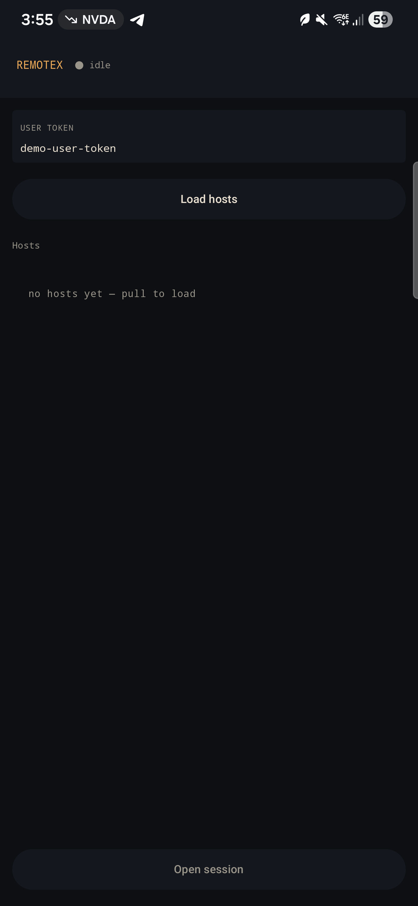

<p align="center">
  
</p>

# Remotex

Remotex lets you control Codex sessions running on your own machines from
a browser, Android app, or iPhone app. The machine running Codex can sit
behind NAT, CGNAT, VPNs, or firewalls because it never needs an inbound
port: both the client and the host daemon dial out to a relay you control.

## How It Works



The relay is a rendezvous point. It authenticates clients and daemons,
tracks which hosts are online, reserves session IDs, and routes frames
between a client and the selected daemon. Codex itself still runs locally
on the host through `codex app-server`.

Two credentials are intentionally separate:

| Credential | Used by | Stored at |
| --- | --- | --- |
| Remotex bridge token | daemon -> relay auth | `~/.remotex/config.toml` |
| Codex/OpenAI auth | `codex app-server` -> OpenAI auth | `~/.codex/auth.json` |

The daemon does not read the Codex auth file. It only starts the local
Codex app server process.

## Screenshots

A live web session: pick an online host, open a session, send a prompt,
watch reasoning, tool calls, and streamed agent messages arrive live:

<p align="center">
  
</p>

The three surfaces side-by-side (click to view full size):

<table>
  <tr>
    <td align="center" valign="top" width="50%">
      <br/>
      <sub><b>Web · desktop</b> (1440 × 900)</sub>
    </td>
    <td align="center" valign="top" width="25%">
      <br/>
      <sub><b>Web · mobile</b> (390 × 844)</sub>
    </td>
    <td align="center" valign="top" width="25%">
      <br/>
      <sub><b>Android</b> (Kotlin + Compose)</sub>
    </td>
  </tr>
</table>

The debug APK defaults to `http://10.0.2.2:8080`, which reaches the host
machine from an Android emulator. For a real phone, build with your LAN or
public relay URL:

```bash
cd android
./gradlew assembleDebug -PrelayUrl=http://<your-lan-ip>:8080
```

## Runtime Flow

1. The daemon connects to `/ws/daemon` and sends `hello` with its bridge
   token, hostname, platform, and nickname.
2. The relay validates the bridge token, marks that host online, and
   replies with `welcome`.
3. A web, Android, or iPhone client calls `GET /api/hosts` with a user
   token and chooses an online host.
4. The client calls `POST /api/sessions` for that host. The relay reserves
   a `session_id`; it does not start Codex yet.
5. The client opens `/ws/client` and sends `hello` with the user token and
   `session_id`.
6. After the client is attached, the relay sends `session-open` to the
   daemon. This ordering makes sure the client sees `session-started` and
   every later event.
7. A client prompt becomes a `turn-start` frame.
8. The daemon translates that into Codex `turn/start` over stdio.
9. Codex notifications are normalized into `session-event` frames and
   streamed back through the relay to the client.
10. When semantic search is configured, the relay stores completed user
    prompts, final Codex answers, and reasoning chunks in pgvector so web,
    Android, and iPhone clients can search prior chats through `/api/search`.

## Repo Layout

```text
remotex/
├── apps/web/              React + Vite control-plane web client
├── android/               Kotlin + Jetpack Compose native client
├── apple/                 SwiftUI iPhone client
├── services/
│   ├── relay/             aiohttp relay + SQLite inventory + WS routing + search
│   ├── daemon/            outbound-WSS daemon + Codex adapters
│   ├── web/               legacy single-file demo UI
│   ├── scripts/e2e_test.py
│   └── docs/              architecture and protocol notes
├── deploy/
│   ├── Dockerfile.relay   builds web assets and serves relay + UI
│   ├── docker-compose.yml
│   └── Caddyfile          optional TLS reverse proxy
├── docs/                  logo and real product screenshots
└── .github/workflows/     CI for web, Python, and Android
```

More detail lives in the subproject READMEs:

- [`apps/web/README.md`](apps/web/README.md)
- [`android/README.md`](android/README.md)
- [`apple/README.md`](apple/README.md)
- [`services/README.md`](services/README.md)
- [`deploy/README.md`](deploy/README.md)

## Quick Start

### 1. Run the Relay

```bash
cd services
pip install -r requirements.txt
python3 relay/app.py
```

The relay listens on `http://127.0.0.1:8080` and seeds demo credentials
on first run:

```text
user token:   demo-user-token
bridge token: demo-bridge-token
```

### 2. Run a Daemon

Use `stdio` mode for real Codex. You need the `codex` CLI installed and
logged in on this machine.

```bash
cd services
python3 -m daemon init \
  --relay-url ws://127.0.0.1:8080/ws/daemon \
  --bridge-token demo-bridge-token \
  --nickname devbox \
  --mode stdio \
  --default-cwd "$PWD" \
  --config ./demo-config.toml

python3 -m daemon run --config ./demo-config.toml
```

For an API-free UI demo, use `--mode mock` instead of `--mode stdio`.

### 3. Run the Web Client

```bash
cd apps/web
npm install
npm run dev
```

Open <http://localhost:5174>. The Vite dev server proxies `/api/*` and
`/ws/*` to the relay on `127.0.0.1:8080`.

### 4. Build the Android App

```bash
cd android
cp local.properties.example local.properties
./gradlew assembleDebug
```

Install to a connected emulator or device:

```bash
./gradlew installDebug
```

Override the relay URL at build time when using a real phone or deployed
relay:

```bash
./gradlew assembleDebug -PrelayUrl=https://relay.example.com
```

### 5. Run the iPhone App

Open the Xcode project and run it on an iPhone simulator:

```bash
open apple/Remotex.xcodeproj
```

The iOS simulator can reach a relay running on the same Mac at
`http://127.0.0.1:8080`. For a real iPhone, enter a LAN or public relay
URL in the app.

### 6. Deploy with Docker Compose

```bash
cd deploy
docker compose up -d --build
```

This builds the web client, bundles it into the relay image, and serves
everything from the relay container on `127.0.0.1:8080`. The Compose
stack also starts Postgres with pgvector for semantic chat search.

To enable Qwen3 embedding search through LiteLLM, set these in `deploy/.env`:

```dotenv
EMBEDDING_API_BASE_URL=http://your-litellm-host:80/v1
EMBEDDING_API_KEY=your-litellm-master-key
EMBEDDING_MODEL=qwen3-embedding
EMBEDDING_DIMENSIONS=4096
EMBEDDING_MAX_CONTEXT_TOKENS=32768
```

For TLS:

```bash
cp .env.example .env
$EDITOR .env
docker compose --profile tls up -d --build
```

## What Works

| Area | Status |
| --- | --- |
| Relay REST + WebSocket transport | Working; SQLite-backed; demo tokens seeded |
| Daemon -> relay connection | Working; outbound WebSocket with reconnect |
| Real Codex bridge | Working through `codex app-server` stdio |
| Mock adapter | Working for tests and offline demos |
| Web client | Lists hosts, opens sessions, sends text turns, streams reasoning/tool/agent events |
| Android client | Lists hosts, opens/resumes threads, renders events, sends turns, supports images, model/effort controls, permissions, approvals, interrupt, reconnect |
| iPhone client | Starter SwiftUI app; lists hosts, opens sessions, sends text turns, streams events, searches chats |
| Semantic chat search | Captures completed turns, chunks user/Codex/reasoning text, embeds with Qwen3-Embedding-8B, stores vectors in pgvector, exposes web/Android/iPhone search |
| Docker Compose | Working relay + web bundle, pgvector search store, optional Caddy TLS |
| CI | ESLint, Vite builds, npm audit, Ruff, backend e2e, Android debug APK artifact, iPhone simulator build |

## Protocol Surface

Relay frames are JSON objects with a `type` field. Session frames also
carry `session_id`.

| Frame | Direction | Purpose |
| --- | --- | --- |
| `hello` | daemon/client -> relay | Authenticate socket |
| `welcome` | relay -> daemon | Confirm daemon host ID |
| `attached` | relay -> client | Confirm client session attach |
| `session-open` | relay -> daemon | Start or resume a Codex thread |
| `turn-start` | client -> daemon | Send user input to Codex |
| `turn-interrupt` | client -> daemon | Interrupt active Codex turn |
| `approval-response` | client -> daemon | Resolve Codex approval request |
| `slash-command` | client -> daemon | Run supported local session command |
| `session-event` | daemon -> client | Stream normalized Codex event |
| `session-closed` | daemon -> client | End the session |

## Current Gaps

These are the main items before this is ready for real users:

1. Replace demo bearer tokens with OIDC/Keycloak login.
2. Move the relay store from SQLite to Postgres.
3. Add audit logs, metrics, rate limits, and bounded queues.
4. Add web UI support for approvals, thread resume, model/effort controls,
   image attachments, and permissions so it matches Android.
5. Bring the iPhone app to Android feature parity: thread resume, images,
   model/effort controls, permissions, approvals, interrupt, and reconnect.
6. Add mobile push notifications for approval requests.
7. Add more fault tests: daemon disconnect, duplicate client attach, bad
   tokens, slow clients, and host offline during a turn.
8. Add Kubernetes manifests for multi-user deployments.

## Development

Run the main checks locally:

```bash
# Web workspaces
npm ci && npm run lint && npm run build
(cd apps/web && npm ci && npm run lint && npm run build)

# Python
(cd services && pip install -r requirements-dev.txt && ruff check .)
(cd services && python scripts/e2e_test.py)

# Android
(cd android && ./gradlew assembleDebug)

# iPhone
open apple/Remotex.xcodeproj
```

Regenerate web client screenshots after starting the relay, daemon, and
`apps/web` dev server:

```bash
node scripts/capture-web-screenshots.mjs
```

## Status

`v0.1` - the relay, daemon, real Codex bridge, web client, Android client,
iPhone starter, Docker deployment, and CI all have working vertical slices.
The project is usable for self-hosted development, but it still needs
production auth, storage, auditability, and stronger failure handling before
public use.

## License

MIT License. See [`LICENSE`](LICENSE).
